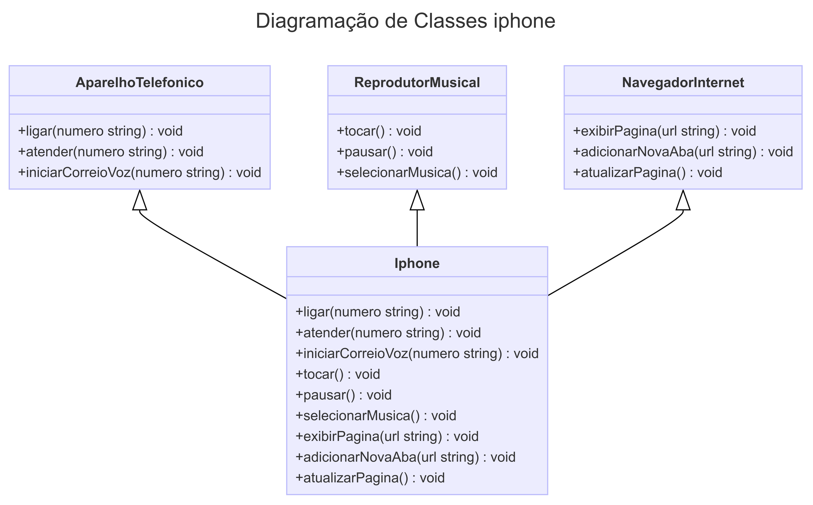

<h1> 📱 Diagramação de classes do iPhone</h1>

## 📋 Descrição

Neste repositório, você encontrará uma implementação abrangente de um desafio de modelagem de software que tem como objetivo representar de forma específica
e precisa as funcionalidades de um iPhone. Este projeto utiliza princípios de programação orientados a objetos e técnicas de modelagem UML para criar
uma estrutura robusta e versátil que permite que um dispositivo iPhone desempenhe os três papéis distintos e cruciais: Reprodutor Musical, Aparelho Telefônico e Navegador na Internet.

## 📊 Diagrama UML

- iPhone
 
Uma classe iPhoneé uma classe principal que representa o dispositivo como um todo. Ela implementa as interfaces ReprodutorMusical, AparelhoTelefonicoe NavegadorInternet. Isso permite que o iPhone desempenhe os papéis de reprodutor musical, aparelho telefônico e navegador na Internet.

- ReprodutorMusical

A interface ReprodutorMusicaldefine os métodos necessários para controlar a reprodução de música, como tocar(), pausar()e selecionarMusica(). As classes que implementam essa interface são capazes de reproduzir músicas.

- AparelhoTelefonico

A interface AparelhoTelefonicodefine os métodos para realizar chamadas telefônicas e enviar mensagens, incluindo ligar(), atender()e iniciarCorreioVoz(). As classes que implementam essa interface podem funcionar como dispositivos telefônicos.

- NavegadorInternet

Uma interface NavegadorInternetdefine métodos para a navegação na web, como exibirPagina(), adicionarNovaAba()e atualizarPagina(). As classes que implementam essa interface podem atuar como navegadores da Internet.

Cada classe ou interface desempenha um papel específico no sistema e contribui para as características do dispositivo iPhone, tornando-o capaz de realizar uma variedade de funções.

Se você deseja explorar mais detalhes do diagrama de classes clique aqui para ser redirecionado ao arquivo PDF correspondente.

## 💡 Resumo do projeto

Este repositório foi uma fonte de habilidades de aprendizado para mim, em busca de aprofundar seus conhecimentos em modelagem de software, programação orientada a objetos e design de sistemas de software complexos.

